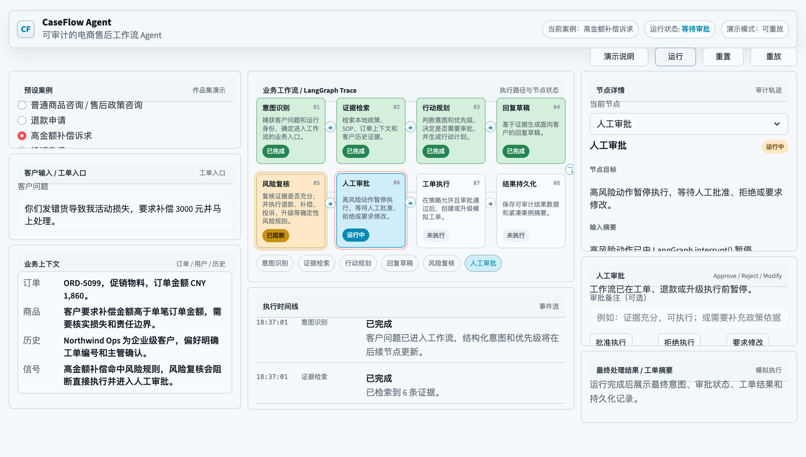
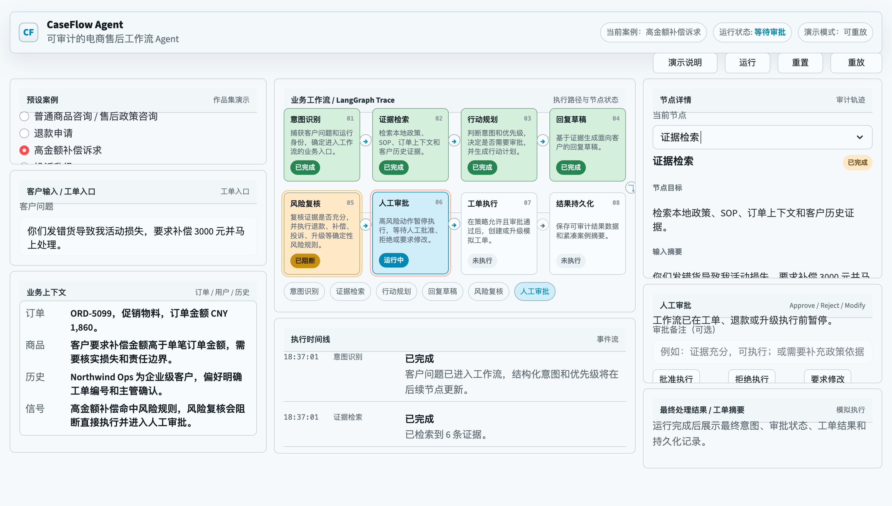
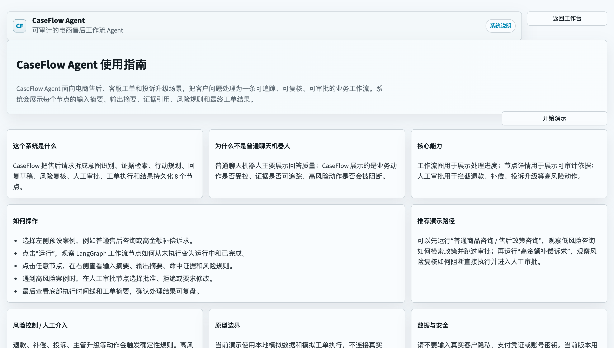
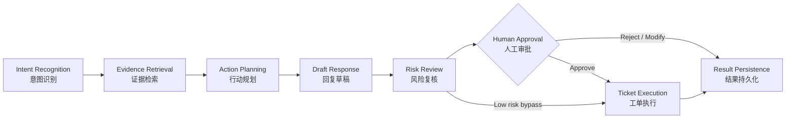
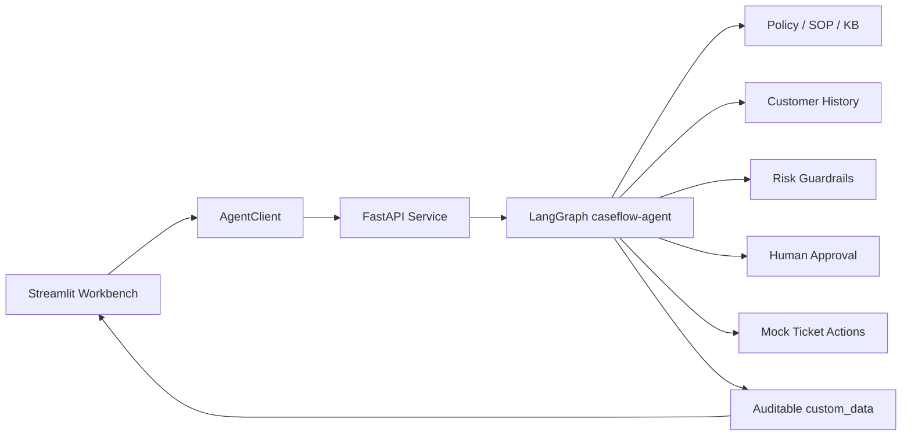

# CaseFlow Agent

面向电商售后、客服工单和投诉升级场景的可审计 Agent workflow demo。

CaseFlow 不把客服问题当成一次普通聊天，而是把它放进一条可追踪的业务流程：识别意图、检索证据、规划动作、生成回复、复核风险、人工审批、执行模拟工单，并持久化最终结果。

> English summary: CaseFlow Agent is an auditable after-sales workflow agent prototype built with LangGraph, FastAPI, and Streamlit. It demonstrates evidence-grounded decisions, deterministic guardrails, human-in-the-loop approval, and traceable ticket outcomes.



## 核心看点

- **不是普通 chatbot**：展示的是业务流程如何受控执行，而不是只展示回答文本。
- **证据驱动**：每个售后请求会关联政策、SOP、订单上下文、客户历史和案例记忆。
- **可审计 trace**：前端展示 workflow graph、节点状态、输入摘要、输出摘要、证据卡片、风险规则和时间线。
- **高风险 guardrail**：退款、补偿、投诉、主管升级等动作会触发 Risk Review。
- **人工审批**：高风险动作会暂停在 Human Approval，只有批准后才进入模拟工单执行。
- **无密钥 demo**：支持 `USE_FAKE_MODEL=true` 的本地 mock mode，核心流程不依赖真实外部模型。

## Demo 界面

### 一屏工作流视图

左侧选择预设售后案例，中间展示 LangGraph trace，右侧展示节点审计详情和人工审批操作。


### Evidence Inspector

Evidence Retrieval 节点会把业务依据拆成可读证据卡片，例如订单记录、售后政策、客户历史。



### 使用指南页

右上角的 `演示说明` 是公开说明页，提供系统定位、操作步骤、推荐演示路径和原型边界。



## 工作流节点



内部 LangGraph flow：

1. `intake_and_classify`
2. `retrieve_evidence`
3. `plan_actions`
4. `draft_resolution`
5. `reflect_and_risk_check`
6. `request_human_approval_if_needed`
7. `execute_action`
8. `finalize_and_persist`

## 预设案例

Demo mode 内置 5 个电商售后场景，数据都来自本地 mock JSON：

| 案例 | 目标 | 关键路径 |
|---|---|---|
| 普通商品咨询 / 售后政策咨询 | 展示低风险咨询如何检索政策并生成回复 | 跳过人工审批 |
| 退款申请 | 展示订单和退款政策证据 | 触发 Risk Review 与 Human Approval |
| 高金额补偿诉求 | 展示补偿承诺如何被 guardrail 阻断 | 暂停等待审批 |
| 投诉升级 | 展示投诉和主管介入如何进入人工处理 | 主管审批后执行模拟升级 |
| 信息不全 | 展示信息不足时如何要求补充材料 | 不承诺退款，不提前执行 |

预设数据位置：[`data/caseflow/demo_cases.json`](data/caseflow/demo_cases.json)

## 本地运行

### 1. 安装依赖

```sh
uv sync --frozen
```

### 2. 配置 mock mode

创建本地 `.env`，不要提交真实密钥：

```env
USE_FAKE_MODEL=true
DEFAULT_MODEL=fake
```

如需接入真实 OpenAI-compatible 模型，可以在本地 `.env` 中配置：

```env
USE_FAKE_MODEL=false
DEFAULT_MODEL=openai-compatible
COMPATIBLE_MODEL=your_model_name
COMPATIBLE_BASE_URL=https://your-compatible-endpoint.example/v1/
COMPATIBLE_API_KEY=your_api_key
```

### 3. 启动后端

```sh
uv run python src/run_service.py
```

默认服务地址：

- Health: `http://127.0.0.1:8080/health`
- Swagger: `http://127.0.0.1:8080/docs`
- Redoc: `http://127.0.0.1:8080/redoc`

### 4. 启动前端

```sh
AGENT_URL=http://127.0.0.1:8080 uv run python -m streamlit run src/streamlit_app.py --server.port 8501 --server.address 127.0.0.1
```

打开：`http://127.0.0.1:8501`

如果本地网络环境使用代理，可先设置本地地址绕过：

```sh
export NO_PROXY=127.0.0.1,localhost,0.0.0.0
export no_proxy=127.0.0.1,localhost,0.0.0.0
```

## 技术结构

- **LangGraph**：定义售后工单处理 workflow 和 HITL pause/resume。
- **FastAPI**：提供 agent invoke / stream 接口。
- **Streamlit**：提供三栏 demo workbench、workflow graph、node inspector 和审批操作。
- **Pydantic**：约束结构化 CaseFlow 输出。
- **Local JSON tools**：模拟政策库、客户资料、历史案例和工单系统。



## 关键文件

- [`src/agents/caseflow_agent.py`](src/agents/caseflow_agent.py)：LangGraph workflow、HITL、fallback 和结果结构。
- [`src/agents/caseflow_events.py`](src/agents/caseflow_events.py)：运行时 workflow event schema。
- [`src/agents/caseflow_demo.py`](src/agents/caseflow_demo.py)：预设案例加载。
- [`src/streamlit_app.py`](src/streamlit_app.py)：三栏工作台、节点详情、审批 UI。
- [`src/service/service.py`](src/service/service.py)：FastAPI streaming service。
- [`src/client/client.py`](src/client/client.py)：Streamlit 与后端服务的客户端。
- [`data/caseflow/`](data/caseflow)：本地 mock 数据和 eval cases。
- [`docs/EVENT_SCHEMA.md`](docs/EVENT_SCHEMA.md)：前后端事件同步协议。
- [`docs/CASEFLOW_PORTFOLIO_DEMO.md`](docs/CASEFLOW_PORTFOLIO_DEMO.md)：公开 demo 说明。
- [`docs/demo-runbook.md`](docs/demo-runbook.md)：本地演示和验证路径。

## 验证命令

```sh
uv run python -m ruff check src tests scripts
uv run python -m pytest -q
uv run python scripts/evaluate_caseflow.py
```

当前测试覆盖包括：

- CaseFlow LangGraph 节点和 fallback 行为；
- workflow event schema；
- Streamlit workbench 关键 UI helper；
- service streaming；
- deterministic evaluation。

## 安全与隐私

- 仓库不需要提交 `.env`，真实 API key 应只保存在本地环境变量或部署平台 secret 中。
- 截图和 demo 数据使用本地 mock case，不包含真实客户资料、真实订单或真实支付信息。
- `create_ticket()`、`escalate_ticket()`、`save_case_note()` 都是确定性的模拟动作，不会调用真实 CRM、退款、赔付或工单系统。
- UI 展示的是可审计业务 trace，不展示模型隐藏推理链路。
- 公开仓库前建议运行：

```sh
git status --short
rg -n "API_KEY|SECRET|TOKEN|PASSWORD" README.md docs src data tests .gitignore
```

## 原型边界

CaseFlow 是 workflow agent 产品原型，不是生产客服系统。

当前限制：

- 检索使用本地 JSON 和规则匹配，不是生产级 RAG；
- 执行动作是 mock，不连接真实售后系统；
- 人工审批已模拟 approve / reject / modify，但修改后重写草稿仍可继续扩展；
- 真实上线需要补充登录鉴权、权限矩阵、审计日志、监控、线上评估和真实业务系统 adapter。

## License

MIT License. See [`LICENSE`](LICENSE).
