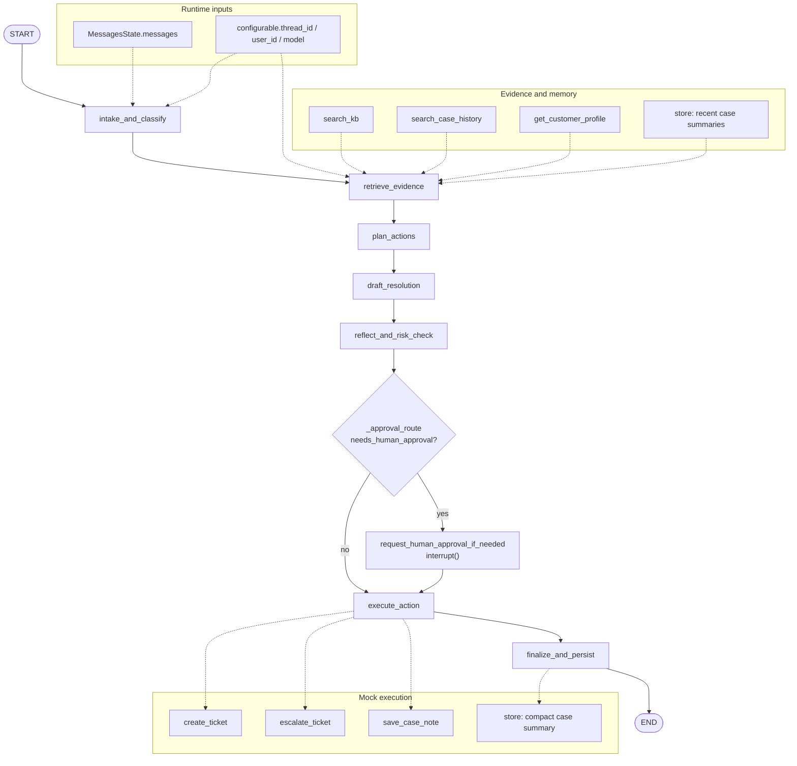

# CaseFlow LangGraph Flow

**Last updated:** 2026-04-28  
**Source of truth:** `src/agents/caseflow_agent.py`

This document explains the current `caseflow-agent` graph at LangGraph node level. The public system architecture is Streamlit -> FastAPI -> LangGraph -> tools/store -> `custom_data`; this page focuses on what happens inside the compiled graph.

## Complete Graph

## State Contract

The graph state is `CaseFlowState`, which extends LangGraph `MessagesState` and adds CaseFlow-specific fields. Internal state fields such as `retrieved_context`, `analysis`, `draft`, `reflection`, `execution_result`, and `typed_result` stay JSON-safe dictionaries so checkpointing and service serialization remain stable.

The external compatibility boundary is `caseflow_result`. `finalize_and_persist` writes the validated result into `AIMessage.additional_kwargs["custom_data"]`, which is what FastAPI and Streamlit read.

## Node Responsibilities

| Node | Main input | Main output | Responsibility |
|---|---|---|---|
| `intake_and_classify` | latest `HumanMessage`, `thread_id`, `user_id`, model config | initial `caseflow_result` | Captures the current customer query and request identity. It does not perform real classification despite the historical name. |
| `retrieve_evidence` | query, user id, optional LangGraph store | `retrieved_context`, evidence list, customer profile | Loads local KB evidence, historical case evidence, mock customer profile, and recent same-customer compact memory when a store is available. |
| `plan_actions` | evidence, customer profile, model config | `analysis`, intent, priority, approval flag, initial action plan | Runs LLM-assisted analysis when available, then falls back to deterministic rules. This node owns business triage. |
| `draft_resolution` | analysis, evidence, model config | `draft`, draft response, resolution reasoning | Generates the customer-facing draft. It preserves planning decisions instead of recomputing the business action plan. |
| `reflect_and_risk_check` | analysis, draft, evidence, model config | `reflection`, policy-guarded `caseflow_result` | Performs risk reflection and applies deterministic guardrails for refund, compensation, complaint, escalation, supervisor, and high-priority cases. |
| `request_human_approval_if_needed` | high-risk `caseflow_result` | approval decision and pending/rejected/modified/approved execution status | Calls LangGraph `interrupt()` and waits for resume input. Structured approve/reject/modify decisions are parsed before execution continues. |
| `execute_action` | approval status, intent, thread/user ids | mock ticket/escalation/case-note result | Separates recommended actions from execution. It only creates mock tickets/escalations and records mock case notes. |
| `finalize_and_persist` | complete `caseflow_result`, optional store | final `AIMessage` with `custom_data`, compact memory write result | Validates the final business result, writes a compact case summary when a store exists, and returns the stable UI/API payload. |

## Control Points

- `_approval_route` is the only conditional edge. It checks `caseflow_result["needs_human_approval"]` after reflection and policy guardrails.
- High-risk cases pause at `request_human_approval_if_needed` through LangGraph `interrupt()`.
- Resume must use the same `thread_id`; the service resumes the graph with `Command(resume=...)`.
- `approve` continues to `execute_action`; `reject` and `modify` also flow to `execute_action`, but execution records rejection or modification request and does not create an approved ticket action.
- LLM calls are optional. If JSON extraction, schema validation, or model invocation fails, the graph falls back to deterministic rules and marks the model label with `:fallback`.

## Interview Explanation

The key design choice is that CaseFlow is not a single prompt that directly writes a reply. The graph separates evidence retrieval, business planning, response drafting, risk reflection, human approval, and execution. That separation makes each behavior easier to test and explain:

- Retrieval can be improved later without changing approval policy.
- Draft wording can change without mutating the planned business action.
- Policy guardrails remain deterministic even when the LLM output is unstable.
- Human approval is a graph-level pause/resume, not a UI-only convention.
- The UI/API contract remains a stable `custom_data` dictionary while internal nodes use typed Pydantic validation.
